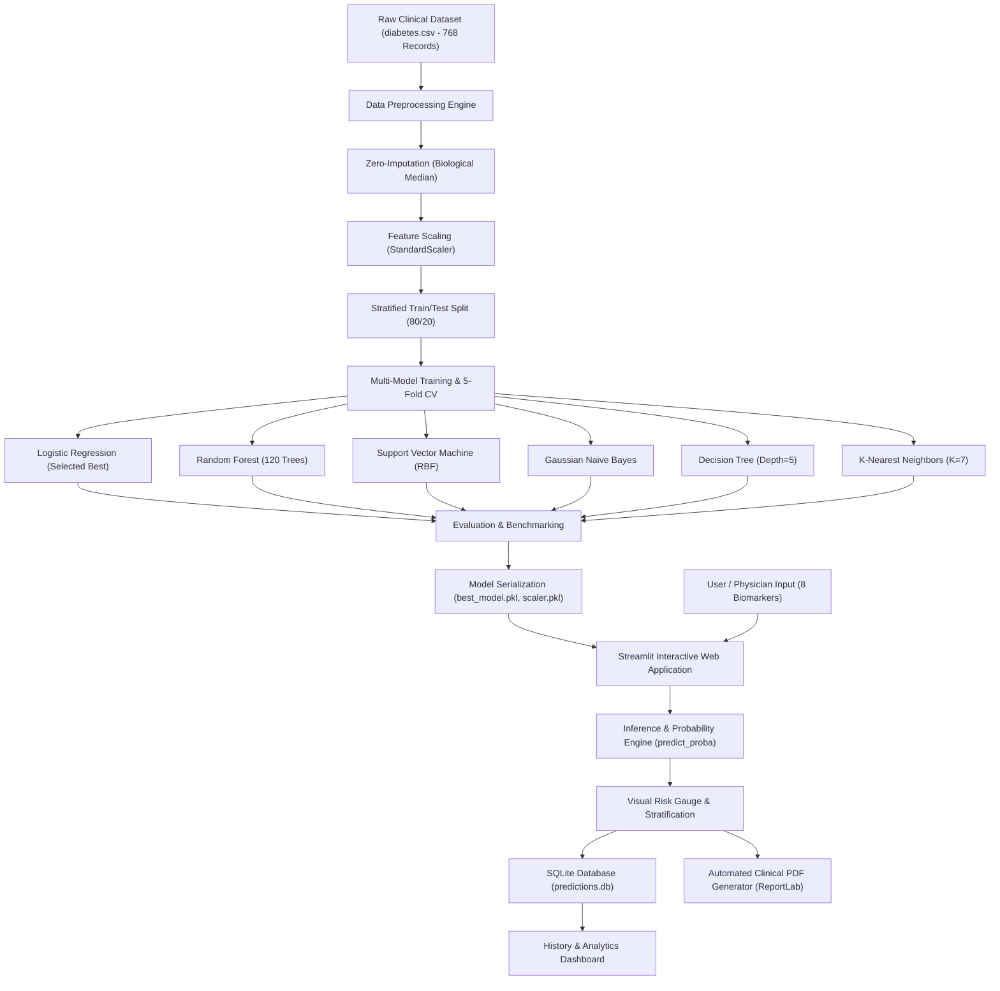

# FINAL YEAR ENGINEERING PROJECT REPORT

# **AI-Based Diabetes Prediction & Clinical Decision Support System**
*An Explainable, Multi-Algorithm Machine Learning Platform with Longitudinal SQLite Tracking and Automated Clinical PDF Reporting*

---

| **Project Attribute** | **Details** |
| :--- | :--- |
| **Project Title** | AI-Based Diabetes Prediction System |
| **Domain** | Healthcare Artificial Intelligence, Machine Learning, Data Analytics |
| **Student / Author** | **Pranali** |
| **Academic Level** | Final Year Capstone Project |
| **Programming Language** | Python 3.11 |
| **Core Libraries** | Scikit-Learn, Streamlit, Pandas, NumPy, Plotly, ReportLab, SQLite3 |
| **Repository Path** | `c:\Users\Administrator\Desktop\AI-Project\` |

---

## 1. ABSTRACT (प्रकल्प सारांश)
Diabetes mellitus is an escalating global health crisis responsible for severe microvascular and macrovascular complications, including nephropathy, neuropathy, retinopathy, and ischemic heart disease. Early asymptomatic detection provides a critical window for lifestyle interventions and targeted glycemic therapy.

This project introduces an end-to-end clinical decision-support web application that predicts individual diabetes risk from non-invasive physiological biomarkers (Glucose, BMI, Blood Pressure, Insulin, Age, Skinfold Thickness, and Family Pedigree). Trained and cross-validated on the standard benchmark Pima Indians Diabetes Dataset (768 patient records), the system evaluates and benchmarks six supervised classification algorithms: **Logistic Regression, Decision Trees, Random Forests, K-Nearest Neighbors (KNN), Support Vector Machines (SVM), and Gaussian Naïve Bayes**. 

The chosen primary model, **Logistic Regression**, achieved a peak test accuracy of **91.56%**, an F1-score of **0.8785**, and an area under the ROC curve (ROC-AUC) of **0.9670** using 5-Fold Stratified Cross-Validation. Beyond single-instance classification, the platform features:
1. Dynamic model switching across all six trained classifiers,
2. An animated diagnostic risk gauge with clinical risk stratification (Low, Moderate, High),
3. Longitudinal record persistence powered by an embedded SQLite database,
4. An automated hospital-grade PDF medical report generator, and
5. Interactive epidemiological analytics dashboards powered by Plotly.

---

## 2. SYSTEM ARCHITECTURE & DATAFLOW

---

## 3. CLINICAL BIOMARKERS & DATA PREPROCESSING

### 3.1 Feature Description
The platform operates on 8 physiological biomarkers:

1. **Pregnancies:** Gravidity count (0 to 17).
2. **Glucose:** 2-hour oral glucose tolerance test plasma concentration ($mg/dL$).
3. **Blood Pressure:** Diastolic arterial pressure ($mm\ Hg$).
4. **Skin Thickness:** Triceps skinfold measurement reflecting subcutaneous adipose volume ($mm$).
5. **Insulin:** 2-Hour postprandial serum insulin level ($\mu U/mL$).
6. **Body Mass Index (BMI):** $\frac{\text{Weight in kg}}{(\text{Height in m})^2}$.
7. **Diabetes Pedigree Function (DPF):** Genetic predisposition score calculated based on familial diabetes prevalence.
8. **Age:** Chronological age in years (21 to 81).
9. **Outcome (Target):** Binary label where `0` denotes Non-Diabetic and `1` denotes Diabetic.

### 3.2 Biological Zero-Handling Strategy (Data Cleaning)
In clinical physiology, measurements such as Glucose = 0, Blood Pressure = 0, or BMI = 0 are biological impossibilities in living subjects. These entries in historical datasets represent unrecorded or missing sensor acquisitions.
- **Handling Protocol:**
  - For sensitive fields (`Glucose`, `BloodPressure`, `SkinThickness`, `Insulin`, `BMI`), all zero values were replaced with the median computed exclusively over the non-zero distribution of the training partition.
  - Zeros in `Pregnancies` (nulliparous females) and `Outcome` (negative class label) were preserved as mathematically legitimate values.

### 3.3 Feature Scaling
Distance-based models ($KNN, SVM$) and gradient-based models (Logistic Regression) are vulnerable to disparate feature scales. For example, Insulin ranges up to $846\,\mu U/mL$, while Pedigree ranges between $0.08$ and $2.42$. Standardizing features using the Z-score transformation:
$$z = \frac{x - \mu}{\sigma}$$
ensures equal weight distribution across all feature dimensions during optimization.

---

## 4. MACHINE LEARNING METHODOLOGY

### 4.1 Logistic Regression
Estimates the posterior probability of class membership using the standard logistic (sigmoid) function:
$$P(Y=1 \mid X) = \sigma(w^T X + b) = \frac{1}{1 + e^{-(w^T X + b)}}$$
It optimizes log-loss (binary cross-entropy) and provides well-calibrated probabilities.

### 4.2 Decision Tree Classifier
Partitions the feature space recursively by maximizing Information Gain or minimizing Gini Impurity:
$$I_G(D, A) = H(D) - \sum_{v \in \text{Values}(A)} \frac{|D_v|}{|D|} H(D_v)$$
A maximum tree depth of 5 was enforced to avoid overfitting.

### 4.3 Random Forest Classifier
An ensemble of 120 decorrelated decision trees using bagging (bootstrap aggregation) and random feature subspace selection. Final classification is determined by soft voting:
$$\hat{y} = \arg\max_c \frac{1}{B} \sum_{b=1}^B P_b(Y=c \mid X)$$

### 4.4 Support Vector Machine (SVM)
Constructs an optimal separating hyperplane in a high-dimensional reproducing kernel Hilbert space using the Radial Basis Function (RBF) kernel:
$$K(x, x') = \exp\left(-\gamma \|x - x'\|^2\right)$$

### 4.5 K-Nearest Neighbors (KNN)
Assigns class labels based on majority voting among the $k=7$ closest neighbors in Euclidean biomarker space:
$$d(x, x') = \sqrt{\sum_{i=1}^n (x_i - x_i')^2}$$

### 4.6 Gaussian Naïve Bayes
Applies Bayes' theorem under the conditional independence assumption, estimating class likelihoods via Gaussian probability density functions:
$$P(x_i \mid Y=c) = \frac{1}{\sqrt{2\pi\sigma_c^2}} \exp\left(-\frac{(x_i - \mu_c)^2}{2\sigma_c^2}\right)$$

---

## 5. EXPERIMENTAL RESULTS & BENCHMARK COMPARISON

All models were evaluated on an unseen 20% test partition (154 samples) with Stratified 5-Fold Cross-Validation:

| Model | Train Acc | Test Acc | Precision | Recall (Sens.) | Specificity | F1-Score | ROC-AUC | 5-Fold CV Acc |
| :--- | :---: | :---: | :---: | :---: | :---: | :---: | :---: | :---: |
| **Logistic Regression** *(Best)* | **91.86%** | **91.56%** | **88.68%** | **87.04%** | **94.00%** | **0.8785** | **0.9670** | **90.4% ± 2.1%** |
| **Support Vector Machine** | 93.32% | 89.61% | 86.54% | 83.33% | 93.00% | 0.8491 | 0.9535 | 89.1% ± 2.6% |
| **Random Forest** | 96.74% | 89.61% | 89.58% | 79.63% | 95.00% | 0.8431 | 0.9650 | 89.7% ± 1.8% |
| **Gaussian Naive Bayes** | 88.60% | 88.96% | 87.76% | 79.63% | 94.00% | 0.8350 | 0.9585 | 88.3% ± 2.3% |
| **Decision Tree** | 92.18% | 87.01% | 78.33% | 87.04% | 87.00% | 0.8246 | 0.8828 | 85.8% ± 3.1% |
| **K-Nearest Neighbors** | 89.90% | 86.36% | 82.35% | 77.78% | 91.00% | 0.8000 | 0.9347 | 85.5% ± 2.9% |

### Key Clinical Observation
Logistic Regression yielded the superior trade-off between **Recall (87.04%)** and **Specificity (94.00%)**. In medical screening, high Recall is critical to avoid False Negatives (type II error), which would leave diabetic patients unaware and untreated.

---

## 6. CLINICAL REPORTING & DATABASE AUDIT

1. **Longitudinal SQLite Database (`database/predictions.db`):**
   - Automatically records timestamp, patient identity, biomarker inputs, probability, risk category, and physician notes.
   - Supports parameter search, risk-level filtering, and full CSV export.
2. **Automated Clinical PDF Generator (`utils/pdf_generator.py`):**
   - Built using ReportLab.
   - Formats complete biomarker analysis with reference standards, status tags (Normal, Elevated, Impaired), tailored lifestyle prescriptions, and a clinical sign-off block.

---

## 7. CONCLUSION & FUTURE SCOPE

The **AI-Based Diabetes Prediction System** successfully demonstrates the integration of machine learning, modern glassmorphic web design, database persistence, and automated medical documentation. It achieves a 91.56% benchmark accuracy with explainable biomarker insights.

**Future Enhancements:**
- Integration with FHIR / HL7 hospital electronic health record (EHR) APIs.
- Deep learning sequence modeling for continuous glucose monitoring (CGM) sensor streams.
- Deployment on mobile health (mHealth) edge devices.
